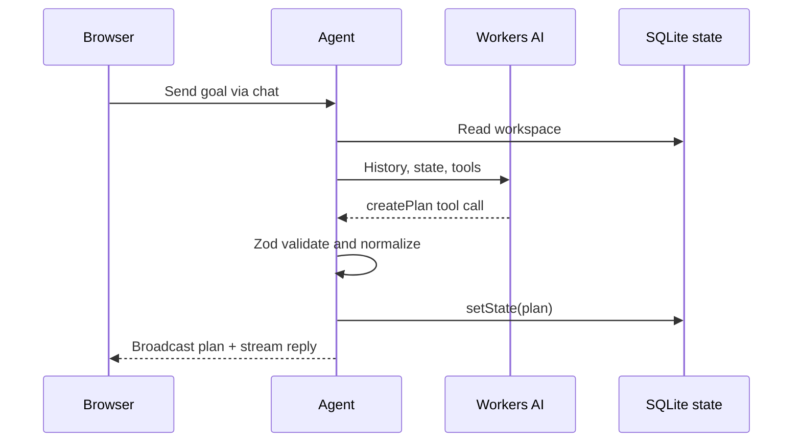

# Architecture

## Frontend

The React client is split into the workspace (`src/components/App.tsx`), shared plan schema/domain functions (`src/lib/plan.ts`), and design tokens/styles (`src/styles/app.css`). `useAgent` connects to a named Agent instance using an opaque random browser identifier. `useAgentChat` handles chat persistence and streamed message updates. `onStateUpdate` updates the plan view after durable mutations. Mobile tabs keep both panels accessible.

## Backend and Agent

`src/server.ts` exports `FlowPilotAgent`, an `AIChatAgent` Durable Object, and routes Agent traffic before falling back to static assets. It holds typed workspace state in the Agent's SQLite-backed state API. The chat base class stores messages. The model is Workers AI Llama 3.3 through `workers-ai-provider` and AI SDK streaming.

## State model

`Workspace` contains `plan`, `preferences`, `updatedAt`, and `revision`. A `Plan` contains goal, summary, assumptions, milestones, tasks, and recommended next action. Task status is `todo` or `done`. Progress is derived from tasks, never trusted from a client value. Plan IDs are normalized on creation; added tasks get UUIDs. `setState` persists updates and broadcasts them to connected clients.

The Agent also persists UI chat messages in its own storage. The browser's `localStorage` contains only the random Agent name, used to reconnect after refresh. With no account login, possession of the name is the access boundary; this is a prototype-level privacy limitation.

## Coordination lifecycle

One chat turn can execute up to five model/tool steps. The model may read the current plan, persist a preference, create or replace a structured plan, update a task, or mark it complete. Each tool validates input and commits a state change before the assistant describes the outcome. The Durable Object runs the workspace operations for its identity and synchronizes state. No separate Workflow is bound because these operations complete within a chat turn; a longer external planning job would use Cloudflare Workflows.

## LLM and tools

`src/agent/prompt.ts` contains the agent's production instructions. Tools use Zod schemas. A request supplies recent chat messages plus a saved workspace snapshot. The model's tool parameters are validated at runtime. A bounded tool loop avoids unlimited calls. `replacePlan` carries over a done status only when the old and new task titles match after normalization.

## Error handling and security

Empty or oversized chat messages return HTTP 400. State-changing UI calls validate task ID/status server-side. Missing tasks produce errors; chat stream failures are logged on the server and shown as a generic retry message. React escapes model text. `.env*` and `.dev.vars*` are ignored. There are no API keys in source. As an anonymous assignment demo, it lacks authentication, rate limits, and anti-abuse controls; use access control before storing sensitive data or making a public multi-user service.
