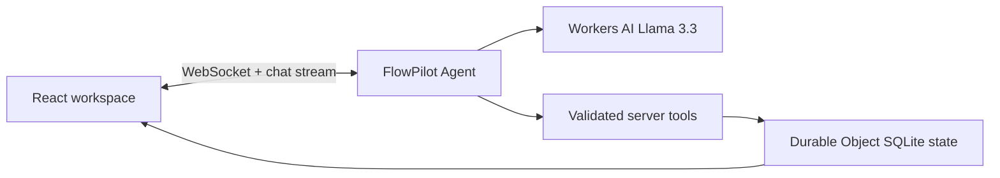

# FlowPilot AI

Turn goals into executable plans. FlowPilot is a persistent planning assistant: describe a goal in chat, get milestones and tasks, check work off, and ask the assistant to adapt the plan as constraints change.

> **Deployment status:** A temporary Cloudflare preview was deployed and its `/` and `/health` routes returned HTTP 200. The preview account is short-lived and is not a stable submission deployment. The live chat request reached the Agent but Workers AI returned error 5034 because the temporary account cannot use this model. The complete AI flow remains unverified.

## Demo

GitHub: [Imanimtiaz2001/flowpilot-ai-cloudflare](https://github.com/Imanimtiaz2001/flowpilot-ai-cloudflare)


Temporary preview URL: https://flowpilot-ai-cloudflare.nosy-course.workers.dev (may expire; a permanent URL requires account authentication).

Try: “Help me prepare for a backend engineering interview in 7 days. I have two hours each weekday.” Then complete a task, refresh, and ask for a revised one-hour schedule.

## Screenshots

Screenshots are pending browser validation against a running Cloudflare Worker. The empty state, chat, and plan are implemented in the React client.

## Why this project

A regular chat can give a plan, but it loses task status and time constraints. FlowPilot keeps a durable workspace, exposes state-changing tools to the model, and synchronizes the saved plan with the browser.

## Features

- Streaming chat and persistent conversation through `AIChatAgent`.
- Structured goal plan, milestones, priorities, tasks, and next action.
- Server-side tools to create, replace, read, and modify a plan, plus store preferences.
- Real task checkboxes and progress updates through validated Agent methods.
- Responsive two-panel interface with mobile tabs, starter prompts, quick actions, and error feedback.
- Durable state synchronized to connected clients; a stable random workspace ID survives browser refresh.

## Cloudflare technologies used

| Requirement | Implementation |
| --- | --- |
| LLM | Workers AI binding using `@cf/meta/llama-3.3-70b-instruct-fp8-fast` |
| Workflow / coordination | `AIChatAgent` runs a bounded multi-step model/tool loop; the Durable Object serializes state-changing operations and broadcasts updates |
| User input | React chat via `useAgentChat`, WebSocket, streamed AI SDK messages |
| Memory / state | SQLite-backed Agent state for plan and preferences; AIChatAgent persists conversation messages |

The project uses Workers Static Assets, the Agents SDK, Durable Objects, Workers AI, React, Vite, AI SDK, and Zod. It intentionally uses the Agent's bounded tool loop rather than a separate Cloudflare Workflow: plan generation and small edits finish within one conversation turn, and the Durable Object is the durable coordination boundary. Long-running research or external jobs would warrant a Workflow.

## Architecture



The model receives current saved workspace context and chat history. It calls validated tools; successful mutations use `setState`, which persists and broadcasts the new workspace. The assistant describes the result only after a tool succeeds. See [ARCHITECTURE.md](ARCHITECTURE.md).

## Memory strategy

The Agent stores one current plan, durable constraints/preferences, revision, and timestamp. Its chat base class retains messages separately. The browser stores only a random workspace identifier to reconnect to the same Agent; plan data is held server-side. The product is anonymous and possession of that identifier controls access, so the prototype should not be used for sensitive goals until account authentication is added.

## Local development

Requirements: Node.js 20+, npm, a Cloudflare account with Workers AI enabled.

```bash
npm install
npx wrangler login
npm run dev
```

Open the URL printed by Vite. Current `@cloudflare/vite-plugin` starts a remote Workers AI proxy even for local development; an authenticated Cloudflare account or `CLOUDFLARE_API_TOKEN` is required. Do not commit the token. The exact dependency versions are captured in `package-lock.json`.

## Environment and bindings

`wrangler.jsonc` declares an `AI` Workers AI binding, `FlowPilotAgent` SQLite Durable Object binding/migration, and `ASSETS` static asset binding. No paid external model key is required. No `.env` or `.dev.vars` file is committed.

## Testing

```bash
npm run typecheck
npm run lint
npm test
npm run build
```

The Vitest domain suite covers schema rejection, ID normalization, task completion/reopening, progress, task edits, and invalid IDs. At preparation time, typecheck and lint passed, 3 tests passed, and build passed. The deployed preview served HTML and `/health`; the WebSocket Agent handshake returned init